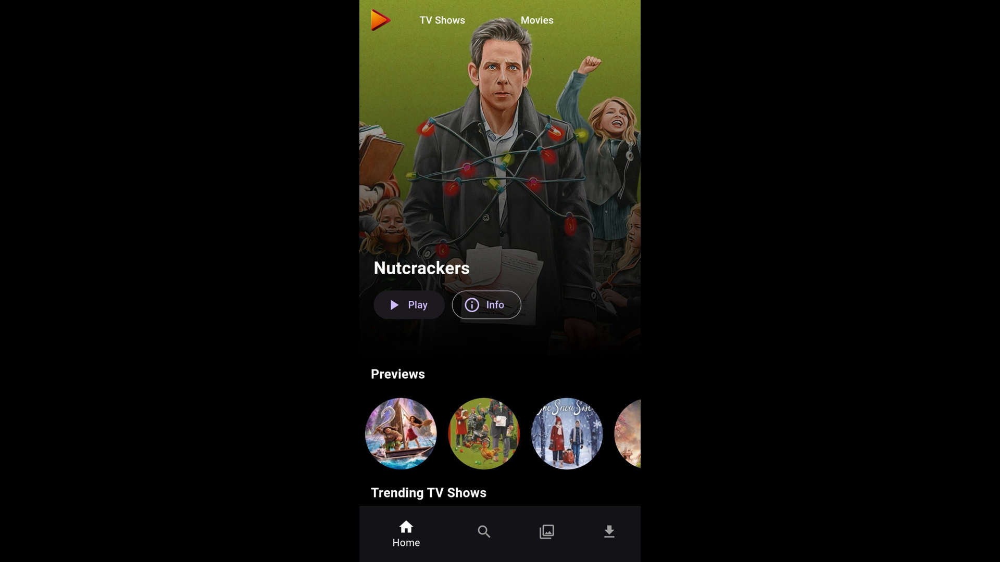
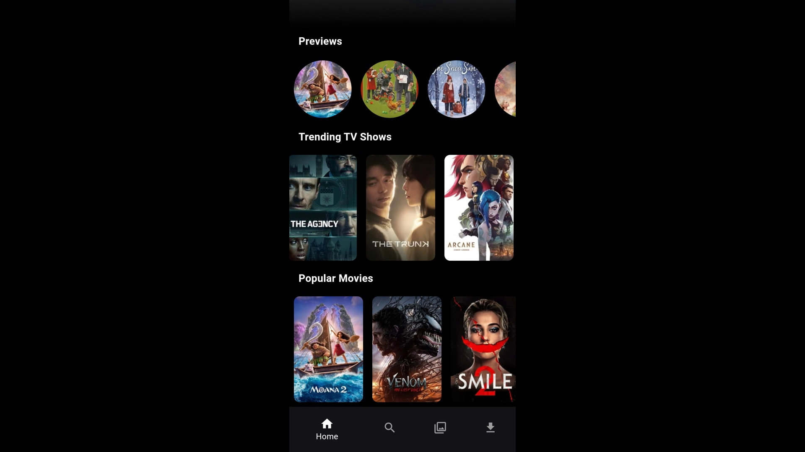
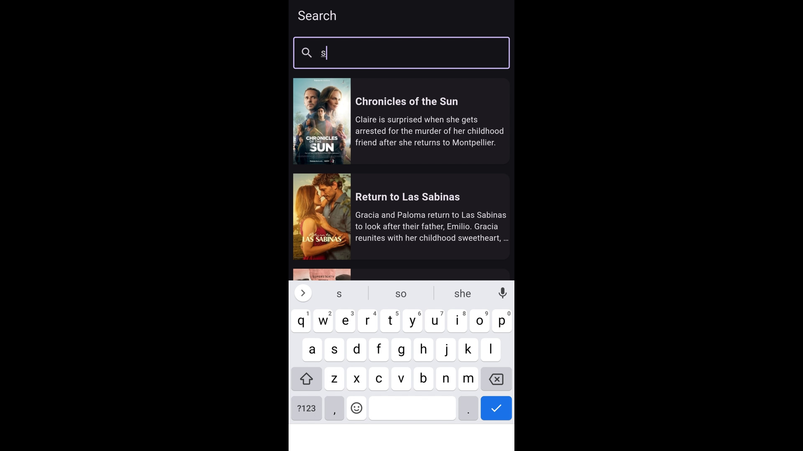
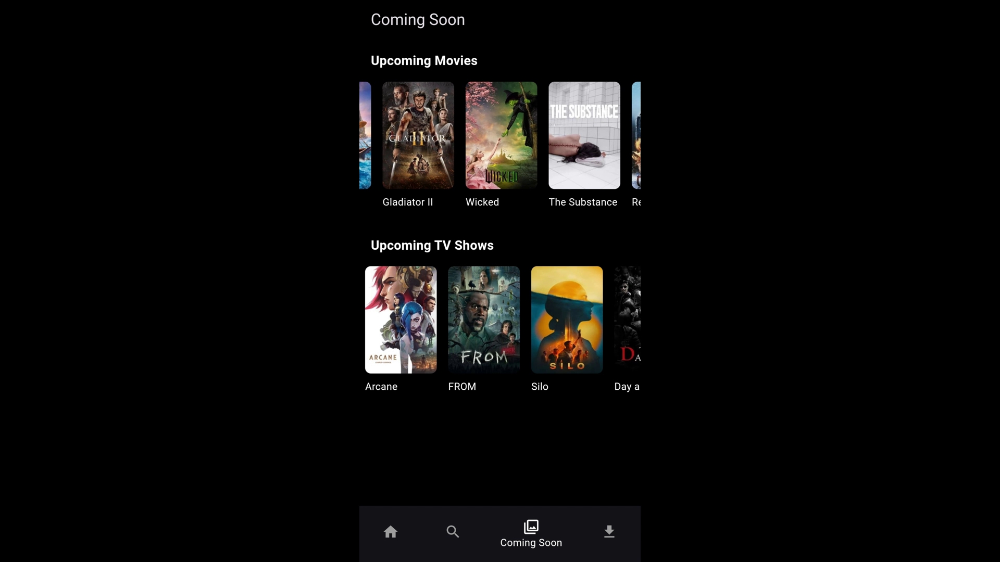
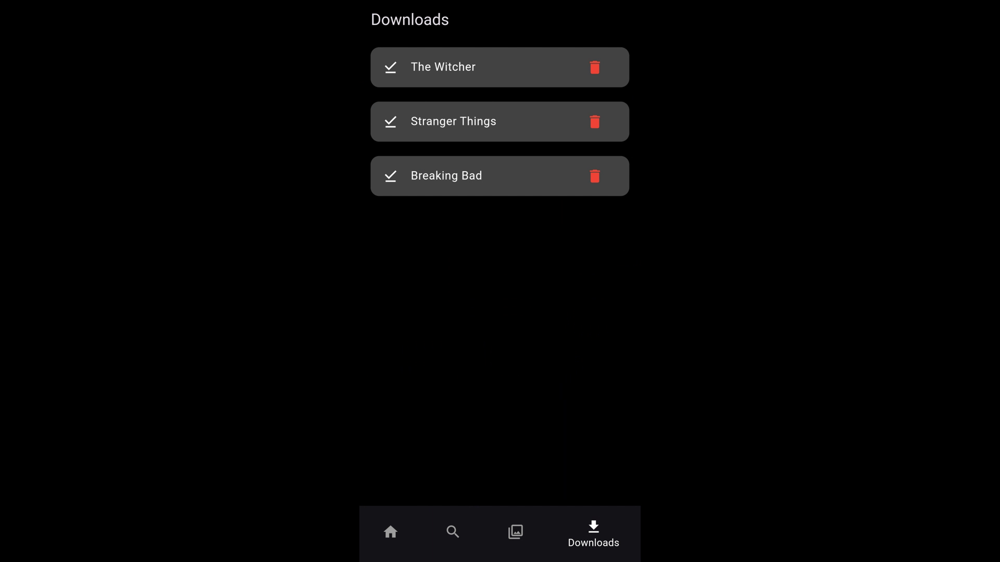
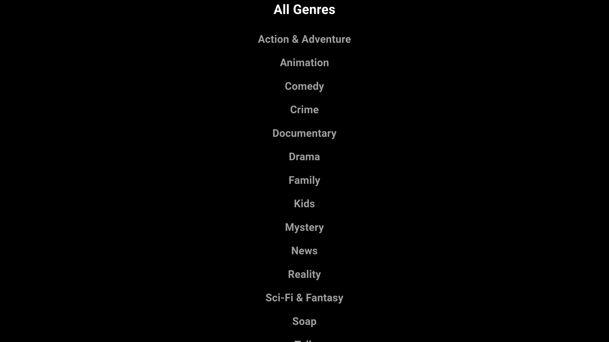
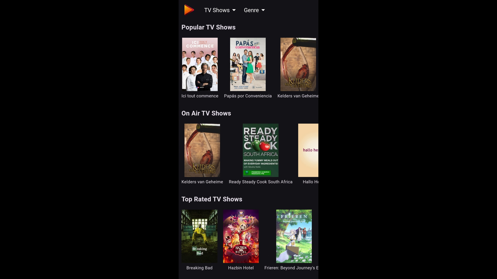
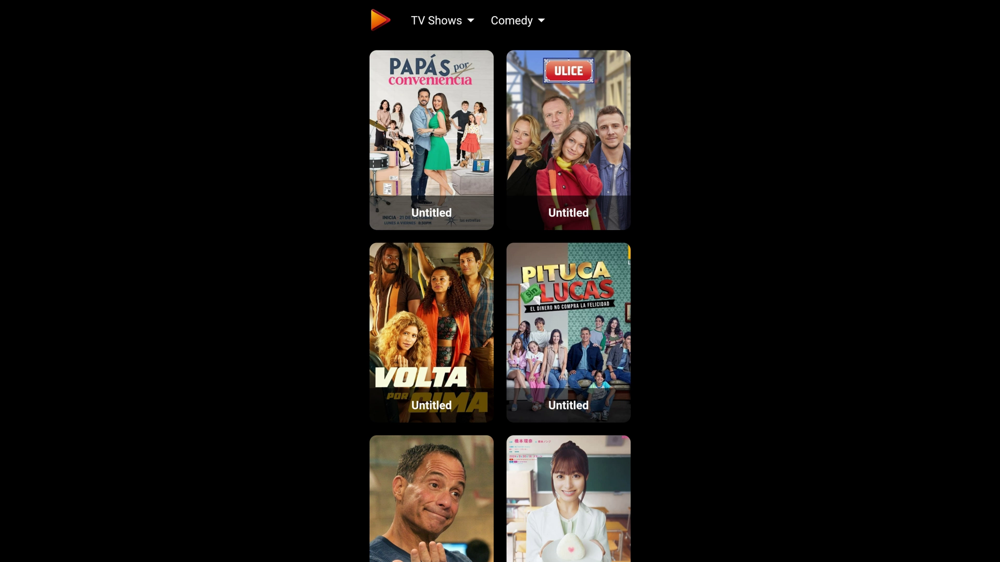

🎬 Strimix App

A Netflix-like UI app built with **Flutter** that uses the **TMDB API** to display movies and TV shows.  
This app provides an elegant browsing experience with trending, popular, and top-rated content.

📱 Screenshots

  
  
  
  

  
  
  
  

✨ Key Highlights

- 🍿 Browse movies and TV shows by category (popular, trending, top-rated)
- 🎯 Search for movies and shows
- 📝 View detailed information including ratings, synopsis, and trailers
- 🎨 Smooth Netflix-style UI
- 📱 Cross-platform app (Android & iOS) built with Flutter
- 🌐 Fetches real-time data from TMDB API

🚀 About This Repository

This repository is intended only for showcasing the app with screenshots and demo.  
The source code is not publicly shared.

📬 Contact

If you’re interested in this project or would like to collaborate, feel free to reach out!
